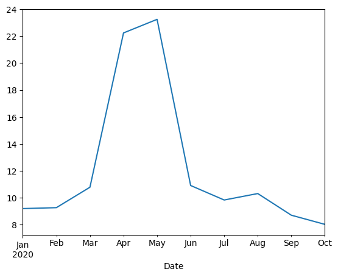
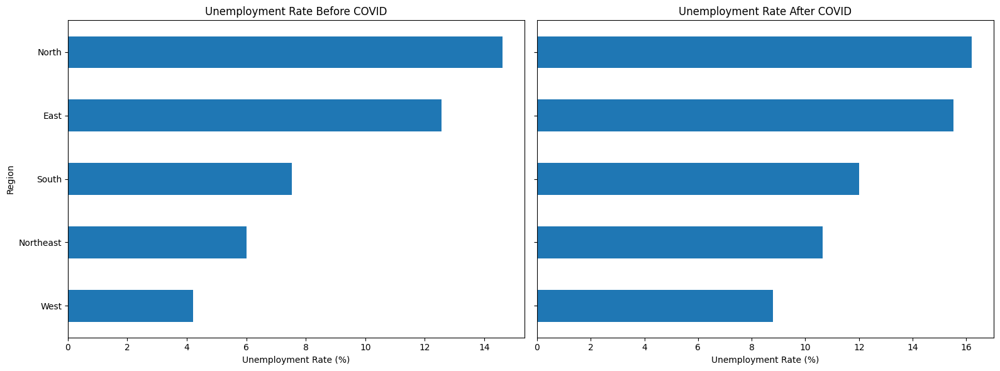
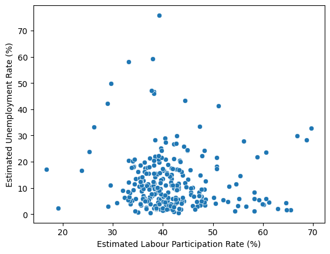
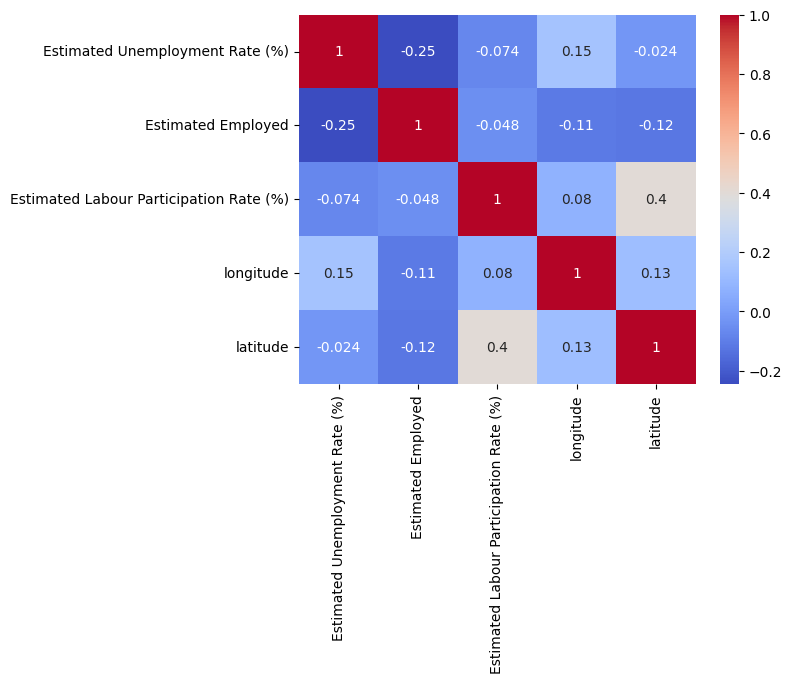
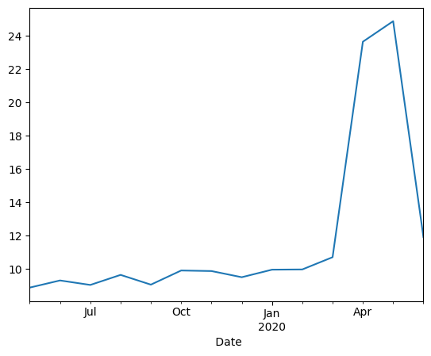
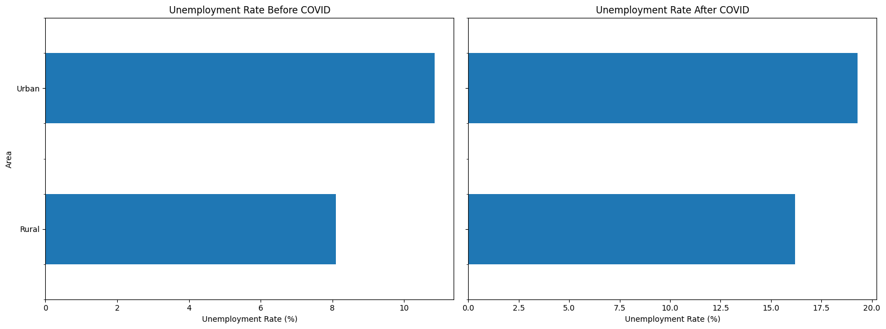
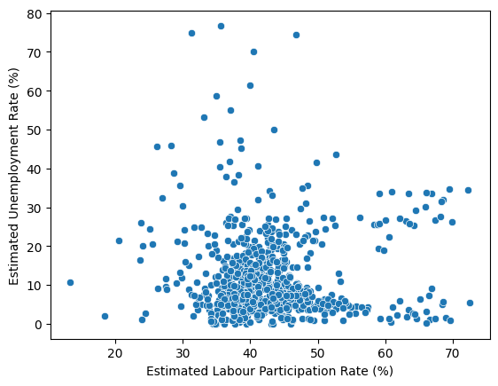
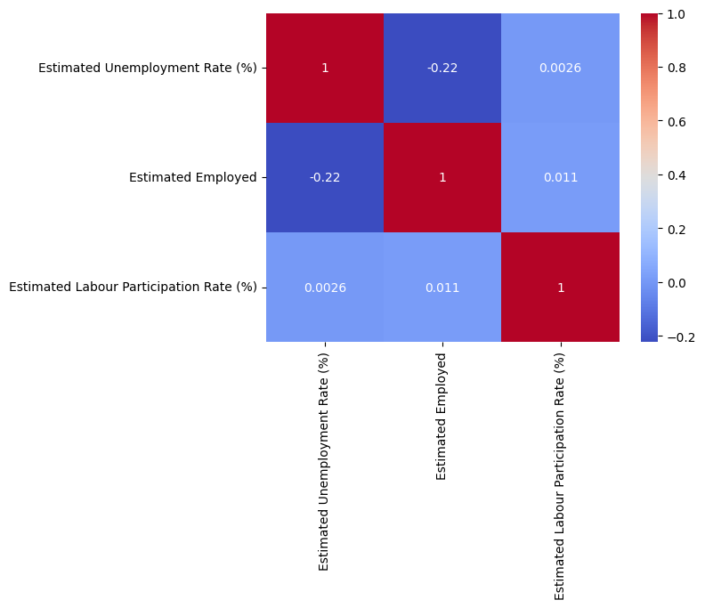

# 📊 Unemployment Analysis in India (COVID-19 Impact Study)

## 🚀 Project Overview

This project presents a comprehensive data analysis of unemployment trends in India, with a specific focus on the impact of COVID-19.

Using two complementary datasets, the analysis explores how unemployment evolved over time, varied across regions and states, and responded to economic disruptions.

The goal of this project is to demonstrate strong data analytics and storytelling skills by combining exploratory data analysis (EDA), visualization, and interpretation.

## 📁 Datasets Used

### Dataset A (`df_main`)

* Contains regional and geospatial data
* Includes: State, Region, Date, Unemployment Rate, Employment, Labour Participation, Latitude & Longitude

### Dataset B (`df_geo`)

* Contains structural labour market data
* Includes: State, Date, Unemployment Rate, Employment, Labour Participation, Area (Urban/Rural)

## 🎯 Objectives

* Analyze unemployment trends over time
* Evaluate the impact of COVID-19 on unemployment
* Compare unemployment across regions and states
* Examine relationships between employment, participation, and unemployment
* Contrast Urban vs Rural unemployment dynamics
* Validate findings across two datasets

## 🛠️ Tools & Technologies

* Python
* Pandas
* NumPy
* Matplotlib
* Seaborn
* Google Colab

## 🔍 Key Analysis Performed

### 1. Time Series Analysis

* Visualized unemployment trends over time
* Identified COVID-19 shock period (March–May 2020)

### 2. Regional & State Analysis

* Compared unemployment across regions and states
* Identified highest and lowest unemployment areas

### 3. COVID-19 Impact Analysis

* Split data into Pre-COVID and Post-COVID periods
* Measured changes across regions and areas

### 4. Employment vs Unemployment

* Explored relationship using scatter plots
* Identified inverse relationship patterns

### 5. Labour Participation Analysis

* Examined whether participation influences unemployment
* Found weak or no direct relationship

### 6. Urban vs Rural Analysis

* Compared unemployment levels across area types
* Identified higher vulnerability in urban areas

### 7. Correlation Analysis

* Quantified relationships between key variables
* Identified strongest predictors of unemployment

### 8. Comparative Analysis

* Validated findings across both datasets
* Ensured consistency and robustness

## 📊 Key Insights

* 📈 **COVID-19 caused a sharp spike in unemployment**, especially between March and May 2020
* 🌍 **Regional disparities exist**, with North and East showing higher unemployment levels
* 🏙️ **Urban areas are more vulnerable** to economic shocks than rural areas
* 👥 **Employment is the strongest predictor of unemployment** (inverse relationship)
* ⚖️ **Labour participation has little direct effect** on unemployment
* 🔁 **Consistent findings across both datasets** strengthen reliability

## 📌 Comparative Summary

| Metric               | Dataset A   | Dataset B  | Insight                       |
| -------------------- | ----------- | ---------- | ----------------------------- |
| Avg Unemployment     | 12.24%      | 11.79%     | Very close → high consistency |
| COVID Impact         | Sharp spike | Same spike | Confirms real-world effect    |
| Highest Areas        | North/East  | Urban      | Structural differences        |
| Strongest Factor     | Employment  | Employment | Consistent predictor          |
| Participation Effect | Weak        | None       | Not reliable predictor        |

## 📉 Sample Visualizations

### Dataset A

Key Insight:

Shows that COVID-19 had an immediate and severe impact on unemployment, causing a sharp but temporary surge.

Key Insight:

COVID-19 had a universal impact, but its severity differed depending on the region’s starting point. Regions with initially low unemployment (West and Northeast) were more vulnerable to sudden economic shocks, experiencing the largest proportional increases. In contrast, regions with already high unemployment (North and East) remained the most affected in absolute terms but showed less relative change.

**Key Insight**:
**Distribution of Points**: The data points are spread across the chart without forming a strong linear trend. This suggests that the relationship between participation and unemployment is complex and context-dependent.

**Patterns Observed**: In some clusters, higher participation coincides with higher unemployment, which could reflect situations where more people are actively seeking work but job creation is limited.

In other clusters, higher participation aligns with lower unemployment, possibly indicating healthier labour markets where more people are employed.

**Outliers** (i.e, like unemployment near and over 70%, a very high unemployment rate despite moderate participation) highlight exceptional cases, perhaps due to economic shocks or structural issues.

**Key Insight**

This shows use literally everything, the matrix quantifies how strongly each pair of variables is related:

For **Estimated Employed vs Unemployment Rate** the correlation is -0.25, which indicates a moderate negative correlation: as employment increases, unemployment tends to decrease. This is the strongest relationship in the matrix.

**Labour Participation vs Unemployment Rate** as -0.074 which indicates a Very weak negative correlation: participation has little direct impact on unemployment, confirming the relationship is complex and indirect.

Employment vs Labour Participation as -0.048 which indicates an essentially no correlation: being employed doesn’t strongly depend on participation rate in this dataset.

**Geographic Factors** (longitude, latitude):

**Unemployment vs longitude** as 0.15 (weak positive)

**Unemployment vs latitude** as -0.024 (negligible)

**Labour Participation vs latitude** as 0.40 (moderate positive correlation, the second strongest in the matrix)

And Other geographic correlations like (longitude vs latitude = 0.13) are simply just very weak.

### Dataset B

Key Insight:

**Key Insight**:

## ⚠️ Limitations

* Limited time range (mostly 2019–2020)
* No sector-specific employment data
* No macroeconomic indicators (GDP, inflation)
* Build an interactive dashboard (Power BI / Tableau)

Give this repo a star ⭐ and feel free to con
